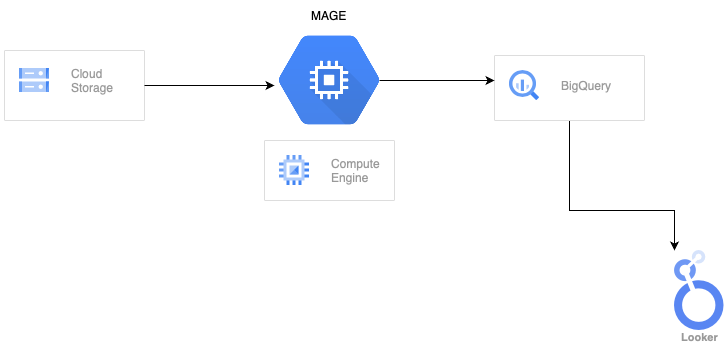
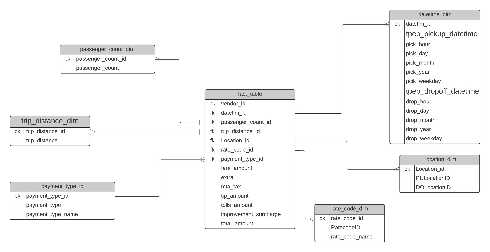

# Uber Data Analytics | NYC Yellow Taxi
## Decription

- This project involves analyzing a sample of NYC Yellow Taxi trip data from May 2022. The project focuses on data engineering tasks, including the creation of a comprehensive fact table and the integration of various dimension keys. The data pipeline was constructed using Mage AI to extract, transform, and load (ETL) the data into BigQuery. The final step involved visualizing the processed data using Looker Studio.

## Architecture

## SQL Schema: Fact and Dimension Tables

- As part of the data engineering process, I created a fact table and several dimension tables to structure the NYC Yellow Taxi trip data efficiently. These tables were designed to support complex queries and data analysis tasks in BigQuery.

## Technologies Used

- Programming Languages: SQL
- Cloud Services: Google Cloud Storage, Google BigQuery, Looker Studio
- Data Pipeline: Mage AI
- Data Source: NYC Yellow Taxi Trip Records (https://www.nyc.gov/site/tlc/about/tlc-trip-record-data.page)

## Prerequisites

- Access to Google Cloud Platform (GCP) with BigQuery and Cloud Storage enabled.
- Mage AI account for building the ETL pipeline.
- Looker Studio for data visualization.

## Visulization

[View the Project Documentation](./Uber_data_viz.pdf)
